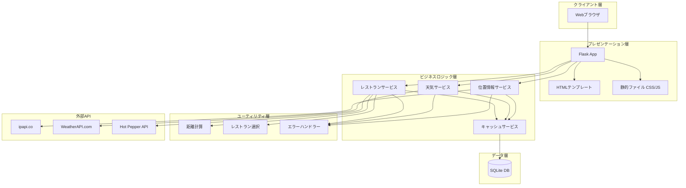
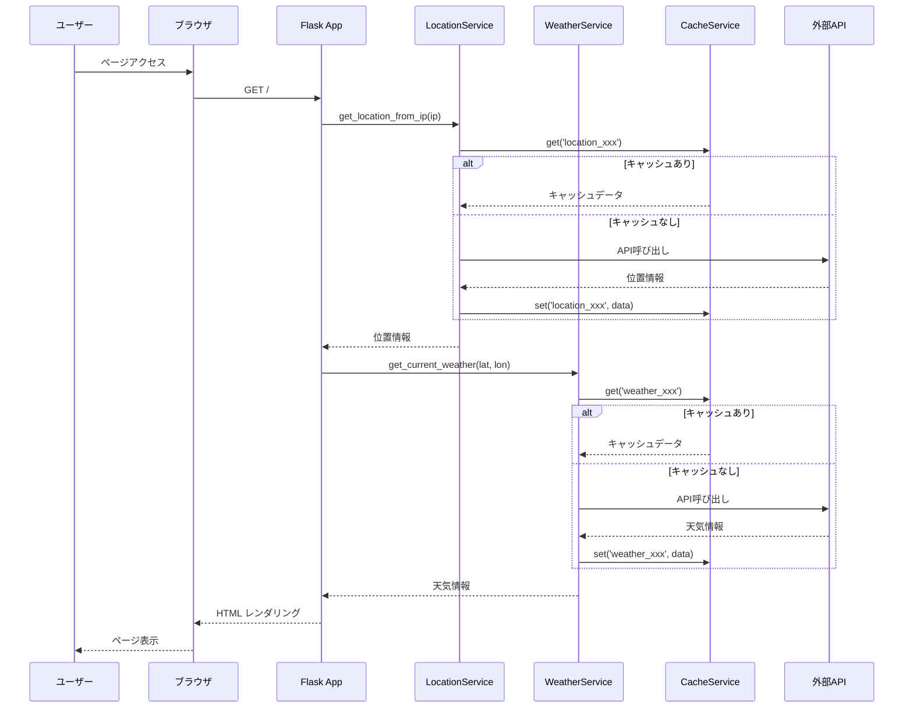
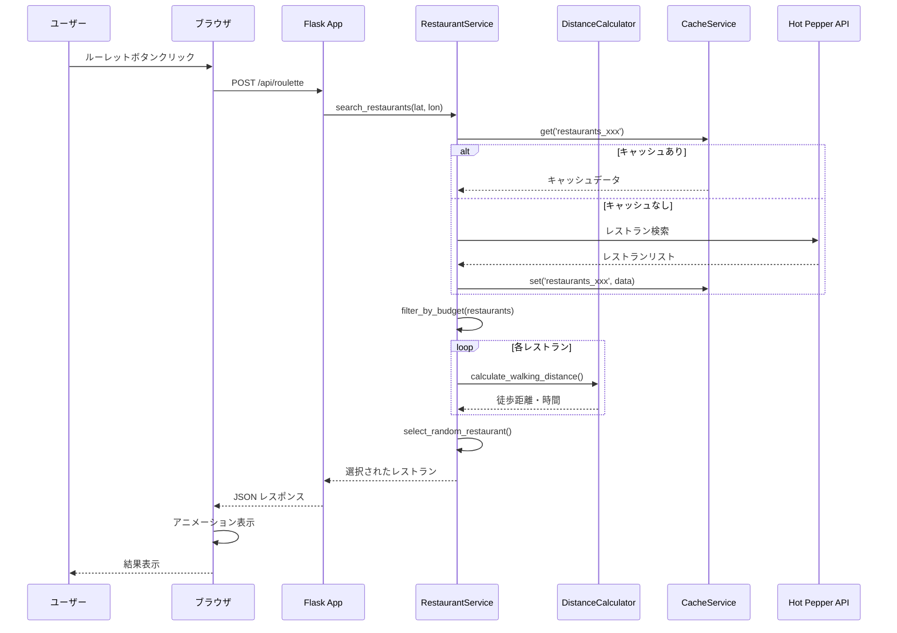
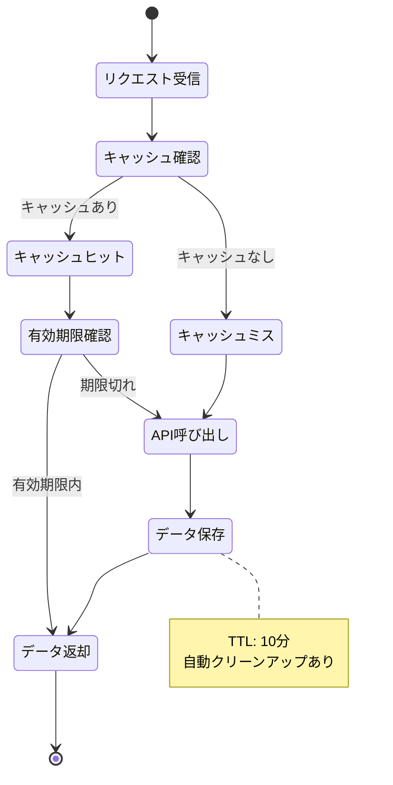

# Lunch Roulette 設計ドキュメント

## 目次

1. [はじめに](#はじめに)
2. [アーキテクチャ概要](#アーキテクチャ概要)
3. [設計パターン](#設計パターン)
4. [モジュール構成](#モジュール構成)
5. [技術選定理由](#技術選定理由)
6. [コーディング規約](#コーディング規約)
7. [テスト戦略](#テスト戦略)
8. [データフロー](#データフロー)

---

## はじめに

このドキュメントは、Lunch Rouletteプロジェクトの設計思想とアーキテクチャを初心者にもわかりやすく説明することを目的としています。

### 対象読者

- Pythonプログラミングの基礎知識がある方
- Webアプリケーション開発に興味がある方
- プロジェクトへの貢献を検討している方

### このドキュメントで学べること

- プロジェクトの全体構造
- 各モジュールの役割と責務
- コードの書き方とベストプラクティス
- テストの考え方

---

## アーキテクチャ概要

### システム全体図



### レイヤー構造

Lunch Rouletteは**4層アーキテクチャ**を採用しています：

1. **プレゼンテーション層**: ユーザーインターフェースとルーティング
2. **ビジネスロジック層**: サービスクラスによる処理
3. **ユーティリティ層**: 汎用的なヘルパー機能
4. **データ層**: データベースとの連携

この構造により、各層の責務が明確になり、保守性が向上します。

---

## 設計パターン

### 1. サービスレイヤーパターン

ビジネスロジックをサービスクラスに集約することで、コードの再利用性と保守性を向上させています。

```python
# サービスクラスの例
class WeatherService:
    """天気情報を取得するサービス"""
    
    def __init__(self, cache_service: CacheService):
        self.cache_service = cache_service
        self.api_key = os.getenv('WEATHERAPI_KEY')
    
    def get_current_weather(self, lat: float, lon: float) -> dict:
        """現在の天気情報を取得"""
        # キャッシュをチェック
        # APIを呼び出す
        # データを整形して返す
        pass
```

**メリット**:
- ビジネスロジックがFlaskアプリから分離される
- テストが容易になる
- コードの再利用が可能

### 2. 依存性注入（Dependency Injection）

サービスクラスは依存関係を外部から注入される設計です。

```python
# app.pyでの使用例
cache_service = CacheService(db_path='cache.db')
location_service = LocationService(cache_service)
weather_service = WeatherService(cache_service)
```

**メリット**:
- テスト時にモックオブジェクトを注入できる
- 疎結合な設計になる
- 設定の変更が容易

### 3. キャッシュパターン

APIレスポンスをキャッシュして、外部APIの呼び出しを削減します。

```python
class CacheService:
    """キャッシュ管理サービス"""
    
    def get_or_set(self, key: str, fetch_func, ttl_minutes: int = 10):
        """キャッシュを取得、存在しない場合は関数を実行してキャッシュ"""
        # キャッシュをチェック
        cached = self.get(key)
        if cached:
            return cached
        
        # データを取得してキャッシュ
        data = fetch_func()
        self.set(key, data, ttl_minutes)
        return data
```

**キャッシュ戦略**:
- **TTL (Time To Live)**: 10分間の有効期限
- **キャッシュキー**: `{service}_{params}` 形式
- **自動クリーンアップ**: 期限切れデータは自動削除

### 4. エラーハンドリングパターン

専用のエラーハンドラークラスで一元的にエラーを処理します。

```python
class ErrorHandler:
    """エラー処理を一元管理"""
    
    def handle_api_error(self, error, service_name: str) -> dict:
        """API呼び出しエラーの処理"""
        # ログ記録
        # デフォルト値を返す
        # エラー情報を整形
        pass
```

**メリット**:
- エラー処理が一箇所に集約
- 一貫したエラーレスポンス
- デバッグが容易

---

## モジュール構成

### ディレクトリ構造と役割

```
src/lunch_roulette/
├── app.py                    # メインアプリケーション（エントリーポイント）
├── config.py                 # 設定管理
├── wsgi.py                   # WSGI設定（本番環境用）
│
├── services/                 # ビジネスロジック層
│   ├── cache_service.py      # キャッシュ管理
│   ├── location_service.py   # 位置情報取得
│   ├── weather_service.py    # 天気情報取得
│   └── restaurant_service.py # レストラン検索
│
├── models/                   # データモデル層
│   └── database.py           # データベース管理
│
├── utils/                    # ユーティリティ層
│   ├── distance_calculator.py    # 距離計算
│   ├── restaurant_selector.py    # レストラン選択ロジック
│   └── error_handler.py          # エラーハンドリング
│
├── static/                   # 静的ファイル
│   ├── css/style.css         # スタイルシート
│   └── js/main.js            # JavaScript
│
└── templates/                # HTMLテンプレート
    └── index.html            # メインページ
```

### 各モジュールの詳細

#### 1. `app.py` - メインアプリケーション

**役割**: Flaskアプリケーションの初期化とルーティング

**主な機能**:
- Flaskアプリの設定
- ルート定義（`/`, `/api/roulette`など）
- サービスインスタンスの管理

**コード例**:
```python
@app.route('/')
def index():
    """メインページを表示"""
    location_service = LocationService(cache_service)
    weather_service = WeatherService(cache_service)
    
    # 位置情報と天気情報を取得
    location = location_service.get_location_from_ip(client_ip)
    weather = weather_service.get_current_weather(lat, lon)
    
    return render_template('index.html', location=location, weather=weather)
```

#### 2. `services/` - ビジネスロジック層

各サービスクラスは単一責任原則に従い、特定の機能に特化しています。

##### `location_service.py`

**役割**: IP アドレスから位置情報を取得

**主な機能**:
- `get_location_from_ip()`: IPから位置情報を取得
- `is_default_location()`: デフォルト位置かチェック

**使用API**: ipapi.co

##### `weather_service.py`

**役割**: 天気情報を取得・整形

**主な機能**:
- `get_current_weather()`: 現在の天気を取得
- `get_weather_icon_emoji()`: 天気に応じた絵文字
- `get_weather_summary()`: 天気の説明文生成

**使用API**: WeatherAPI.com

##### `restaurant_service.py`

**役割**: レストラン検索とフィルタリング

**主な機能**:
- `search_restaurants()`: 周辺レストラン検索
- `filter_by_budget()`: 予算でフィルタリング
- `add_walking_distances()`: 徒歩距離を計算

**使用API**: Hot Pepper Gourmet API

##### `cache_service.py`

**役割**: APIレスポンスのキャッシング

**主な機能**:
- `get_cached_data()`: キャッシュから取得
- `set_cached_data()`: キャッシュに保存
- `get_or_set()`: キャッシュ取得または生成
- `cleanup_expired()`: 期限切れキャッシュ削除

**データベース**: SQLite

#### 3. `models/database.py` - データ層

**役割**: SQLiteデータベースの管理

**主な機能**:
- `init_database()`: データベース初期化
- `get_db_connection()`: 接続取得

**テーブル構造**:
```sql
CREATE TABLE cache (
    id INTEGER PRIMARY KEY AUTOINCREMENT,
    cache_key TEXT UNIQUE NOT NULL,      -- キャッシュキー
    data TEXT NOT NULL,                  -- JSON形式のデータ
    created_at TIMESTAMP,                -- 作成日時
    expires_at TIMESTAMP NOT NULL        -- 有効期限
);
```

#### 4. `utils/` - ユーティリティ層

##### `distance_calculator.py`

**役割**: ハーバーサイン公式による距離計算

**主な機能**:
- `calculate_distance()`: 2点間の距離(km)
- `calculate_walking_distance()`: 徒歩距離と所要時間
- `calculate_walking_time()`: 徒歩時間のみ

**アルゴリズム**: ハーバーサイン公式

```python
def calculate_distance(lat1, lon1, lat2, lon2):
    """
    ハーバーサイン公式:
    a = sin²(Δlat/2) + cos(lat1) × cos(lat2) × sin²(Δlon/2)
    c = 2 × atan2(√a, √(1-a))
    d = R × c
    """
    R = 6371  # 地球の半径 (km)
    # 計算処理...
    return distance
```

##### `restaurant_selector.py`

**役割**: レストランのランダム選択ロジック

**主な機能**:
- `select_random_restaurant()`: ランダム選択
- `select_by_distance()`: 距離順選択
- `select_by_budget()`: 予算内選択

##### `error_handler.py`

**役割**: エラー処理の一元管理

**主な機能**:
- `handle_api_error()`: API エラー処理
- `handle_database_error()`: DB エラー処理
- `log_error()`: エラーログ記録

---

## 技術選定理由

### Flask

**選定理由**:
- ✅ 軽量でシンプル
- ✅ 学習コストが低い
- ✅ 豊富なドキュメント
- ✅ PythonAnywhere無料プランで動作

**代替案との比較**:
- Django: 高機能だが小規模プロジェクトには過剰
- FastAPI: モダンだが学習コストがやや高い

### SQLite

**選定理由**:
- ✅ セットアップ不要
- ✅ サーバーレスで軽量
- ✅ ファイルベースで管理が容易
- ✅ 無料プランでも使用可能

**使用目的**:
- API レスポンスのキャッシュ専用
- 永続的なデータ保存には使用しない

### バニラJavaScript

**選定理由**:
- ✅ 依存関係なし
- ✅ 軽量で高速
- ✅ ブラウザ互換性が高い
- ✅ デプロイが簡単

**代替案との比較**:
- React/Vue: 小規模プロジェクトには過剰
- jQuery: モダンブラウザでは不要

### 外部API選定

#### ipapi.co（位置情報）

**選定理由**:
- ✅ 無料プランあり
- ✅ APIキー不要
- ✅ シンプルなJSON レスポンス

#### WeatherAPI.com（天気）

**選定理由**:
- ✅ 無料プランで100万リクエスト/日
- ✅ 豊富な気象データ
- ✅ 日本語対応

#### Hot Pepper Gourmet API（レストラン）

**選定理由**:
- ✅ 日本のレストラン情報が充実
- ✅ 無料プランで3,000リクエスト/日
- ✅ 詳細な検索条件設定が可能

---

## コーディング規約

### 命名規則

#### 1. クラス名

**PascalCase** を使用

```python
# ✅ Good
class WeatherService:
    pass

class CacheService:
    pass

# ❌ Bad
class weather_service:
    pass
```

#### 2. 関数名・変数名

**snake_case** を使用

```python
# ✅ Good
def get_current_weather():
    pass

user_location = get_location()

# ❌ Bad
def getCurrentWeather():
    pass

userLocation = getLocation()
```

#### 3. 定数

**UPPER_SNAKE_CASE** を使用

```python
# ✅ Good
MAX_BUDGET_YEN = 1200
EARTH_RADIUS_KM = 6371

# ❌ Bad
max_budget_yen = 1200
earthRadiusKm = 6371
```

#### 4. プライベート変数・メソッド

アンダースコア `_` で始める

```python
class LocationService:
    def __init__(self):
        self._api_key = "secret"  # プライベート変数
    
    def _validate_coordinates(self, lat, lon):  # プライベートメソッド
        pass
```

### ドキュメンテーション

#### Docstring

すべての関数・クラスに **Google スタイル** のdocstringを記述

```python
def calculate_distance(lat1: float, lon1: float, lat2: float, lon2: float) -> float:
    """
    2点間の距離を計算する

    Args:
        lat1 (float): 地点1の緯度
        lon1 (float): 地点1の経度
        lat2 (float): 地点2の緯度
        lon2 (float): 地点2の経度

    Returns:
        float: 2点間の距離 (km)

    Raises:
        ValueError: 緯度・経度が無効な場合

    Example:
        >>> calc = DistanceCalculator()
        >>> distance = calc.calculate_distance(35.6812, 139.7671, 35.6895, 139.6917)
        >>> print(f"{distance:.2f} km")
        6.14 km
    """
    # 実装...
```

#### コメント

**日本語**でわかりやすく記述

```python
# ✅ Good
# ハーバーサイン公式を使用して距離を計算
distance = self._haversine(lat1, lon1, lat2, lon2)

# キャッシュの有効期限をチェック
if cache_expires_at < datetime.now():
    self._cleanup_expired_cache()

# ❌ Bad（コメント不足）
distance = self._haversine(lat1, lon1, lat2, lon2)
```

### ファイル構成のルール

#### 1. インポート順序

```python
# 1. 標準ライブラリ
import os
import sys
from datetime import datetime

# 2. サードパーティライブラリ
import requests
from flask import Flask, render_template

# 3. ローカルモジュール
from .services.cache_service import CacheService
from .utils.error_handler import ErrorHandler
```

#### 2. ファイルヘッダー

```python
#!/usr/bin/env python3
# -*- coding: utf-8 -*-

"""
モジュール名 - 簡潔な説明

このモジュールの詳細な説明。
主な機能や使用方法を記述。
"""
```

### 型ヒント

Python 3.11の型ヒントを積極的に使用

```python
from typing import Dict, List, Optional, Any

def search_restaurants(
    lat: float,
    lon: float,
    radius: int = 1
) -> List[Dict[str, Any]]:
    """レストランを検索"""
    pass

def get_cache(key: str) -> Optional[dict]:
    """キャッシュを取得（存在しない場合はNone）"""
    pass
```

### エラーハンドリング

```python
# ✅ Good - 具体的な例外をキャッチ
try:
    response = requests.get(url, timeout=10)
    response.raise_for_status()
except requests.Timeout:
    logger.error("API request timeout")
    return default_value
except requests.HTTPError as e:
    logger.error(f"HTTP error: {e}")
    return default_value

# ❌ Bad - すべての例外をキャッチ
try:
    response = requests.get(url)
except Exception:
    pass
```

---

## テスト戦略

### テストの種類

#### 1. 単体テスト (Unit Tests)

**対象**: 個別の関数・メソッド

**ディレクトリ**: `tests/unit/`

**例**:
```python
# tests/unit/test_distance_calculator.py
import pytest
from src.lunch_roulette.utils.distance_calculator import DistanceCalculator

def test_calculate_distance_tokyo_to_yokohama():
    """東京-横浜間の距離計算テスト"""
    calc = DistanceCalculator()
    distance = calc.calculate_distance(
        35.6812, 139.7671,  # 東京駅
        35.4437, 139.6380   # 横浜駅
    )
    # 実際の距離は約28km
    assert 27 < distance < 29

def test_calculate_distance_invalid_coordinates():
    """無効な座標でのエラーテスト"""
    calc = DistanceCalculator()
    with pytest.raises(ValueError):
        calc.calculate_distance(100, 200, 35, 139)  # 無効な緯度
```

#### 2. 統合テスト (Integration Tests)

**対象**: 複数のモジュールの連携

**ディレクトリ**: `tests/integration/`

**例**:
```python
# tests/integration/test_restaurant_flow.py
def test_restaurant_search_flow():
    """レストラン検索の全体フロー"""
    # 位置情報取得
    location_service = LocationService()
    location = location_service.get_location_from_ip("203.0.113.1")
    
    # レストラン検索
    restaurant_service = RestaurantService()
    restaurants = restaurant_service.search_restaurants(
        location['latitude'],
        location['longitude']
    )
    
    # 結果検証
    assert len(restaurants) > 0
    assert all('name' in r for r in restaurants)
```

#### 3. エンドポイントテスト

**対象**: Flask APIエンドポイント

**例**:
```python
# tests/unit/test_endpoints.py
def test_index_page(client):
    """メインページが正常に表示される"""
    response = client.get('/')
    assert response.status_code == 200
    assert b'Lunch Roulette' in response.data

def test_roulette_api(client):
    """ルーレットAPIが正常に動作する"""
    response = client.post('/api/roulette', json={
        'latitude': 35.6812,
        'longitude': 139.7671
    })
    assert response.status_code == 200
    data = response.get_json()
    assert 'restaurant' in data
```

### テストの実行

```bash
# 全テストを実行
pytest

# 単体テストのみ実行
pytest tests/unit/

# 統合テストのみ実行
pytest tests/integration/

# カバレッジレポート付き実行
pytest --cov=src/lunch_roulette --cov-report=html

# 特定のテストファイルを実行
pytest tests/unit/test_distance_calculator.py

# 特定のテスト関数を実行
pytest tests/unit/test_distance_calculator.py::test_calculate_distance_tokyo_to_yokohama

# 詳細出力で実行
pytest -v
```

### テストカバレッジ目標

| 層 | 目標カバレッジ |
|---|---|
| ユーティリティ層 | 90%以上 |
| サービス層 | 80%以上 |
| モデル層 | 85%以上 |
| エンドポイント | 70%以上 |
| **全体** | **80%以上** |

### モックの使用

外部APIはモックを使用してテスト

```python
from unittest.mock import patch, MagicMock

@patch('requests.get')
def test_weather_service_with_mock(mock_get):
    """モックを使った天気サービステスト"""
    # モックレスポンスを設定
    mock_response = MagicMock()
    mock_response.json.return_value = {
        'current': {
            'temp_c': 20.0,
            'condition': {'text': 'Sunny'}
        }
    }
    mock_get.return_value = mock_response
    
    # テスト実行
    weather_service = WeatherService()
    weather = weather_service.get_current_weather(35.6812, 139.7671)
    
    # 検証
    assert weather['temperature'] == 20.0
    assert weather['condition'] == 'Sunny'
```

### テストデータ

テスト用の固定データを`conftest.py`で定義

```python
# tests/conftest.py
import pytest

@pytest.fixture
def tokyo_coordinates():
    """東京駅の座標"""
    return {
        'latitude': 35.6812,
        'longitude': 139.7671
    }

@pytest.fixture
def sample_restaurant():
    """サンプルレストランデータ"""
    return {
        'id': 'J001234567',
        'name': 'テストレストラン',
        'lat': 35.6815,
        'lng': 139.7675,
        'budget': {'average': '1000円'}
    }
```

---

## データフロー

### 1. メインページ表示フロー



### 2. ルーレット実行フロー



### 3. キャッシュライフサイクル



---

## まとめ

このドキュメントでは、Lunch Rouletteの設計思想と実装の詳細を説明しました。

### 重要なポイント

1. **レイヤー構造**: 責務を明確に分離
2. **サービスパターン**: ビジネスロジックの再利用
3. **キャッシング**: API コストの最適化
4. **エラーハンドリング**: 堅牢な設計
5. **テスト**: 品質保証

### 次のステップ

- [ ] 実際のコードを読んで理解を深める
- [ ] テストを書いてみる
- [ ] 新機能を追加してみる
- [ ] コードレビューに参加する

### 参考資料

- [Flask公式ドキュメント](https://flask.palletsprojects.com/)
- [Python公式スタイルガイド (PEP 8)](https://pep8-ja.readthedocs.io/)
- [pytest公式ドキュメント](https://docs.pytest.org/)
- [RESTful API設計ガイド](https://restfulapi.net/)

---

**質問や改善提案があれば、Issueを作成してください！**
